<div align="center">
  
  # JEMORA.ID 
  ### Platform Lelang Online yang Mudah, Transparan, dan Terpercaya
  
  !Live Demo(https://img.shields.io/badge/🚀_Live_Demo-Visit_Site-success?style=for-the-badge)(iosmana.site/api2-jemora.id.com/halaman_utama)
  !GitHub(https://img.shields.io/badge/GitHub-Repository-181717?style=for-the-badge&logo=github)(https://URL_REPO)
  !License(https://img.shields.io/badge/License-MIT-blue?style=for-the-badge)(LICENSE)
  
  **Submission for ITECHNO CUP 2026 - Web Development**
  
  **By Revorse**
  
</div>

---


## 📋 Daftar Isi

* [Tentang Proyek](#tentang-proyek)
* [Fitur Unggulan](#fitur-unggulan)
* [Demo & Screenshot](#demo--screenshot)
* [Teknologi](#teknologi)
* [Alasan Pemilihan Teknologi](#alasan-pemilihan-teknologi)
* [Dependencies Utama](#dependencies-utama)
* [Arsitektur Sistem](#arsitektur-sistem)
* [System Architecture](#system-architecture)
* [Database Schema](#database-schema)
* [Folder Structure](#folder-structure)
* [Instalasi & Setup](#instalasi--setup)
* [Penggunaan](#penggunaan)
* [API Documentation](#api-documentation)
* [Testing](#testing)
* [Tim Developer](#tim-developer)
* [Lisensi](#lisensi)


---

## 👥 Tim Developer

| Nama | Peran | GitHub |
|------|-------|--------|
| **Moch.Argani Al-Abror** | Project Lead & Full Stack Developer | GitHub(https://github.com/ARGAN-collab) |
| **Afwan Maulana Azidan** | Frontend Developer | GitHub(https://github.com/maula-na0857) |
| **Alzena Lakeisha** | Backend Developer | GitHub(https://github.com/username3) |


---

## 🎯 Tentang Proyek

### Latar Belakang

Lelang masih menghadapi beberapa permasalahan yang dapat membuat masyarakat ragu untuk berpartisipasi. Salah satunya adalah informasi mengenai objek lelang yang belum selalu disampaikan secara lengkap dan seragam. DJKN menyebutkan bahwa informasi yang terbatas dapat menyebabkan salah persepsi terhadap kondisi objek lelang, sehingga calon peserta terkadang perlu melakukan pengecekan secara langsung sebelum memberikan penawaran. Di sisi lain, penipuan yang mengatasnamakan lelang juga masih terjadi. Pada Juni 2026, Pegadaian bahkan mengingatkan masyarakat mengenai maraknya penipuan lelang online melalui media sosial, WhatsApp, dan Telegram yang menawarkan barang dengan harga jauh di bawah pasaran. Permasalahan juga muncul dalam proses penawaran. Pada 25 sampai 30 Juli 2026, dari 31.450 penawaran lelang yang tercatat, sebanyak 24.172 penawaran atau 76,86% ditolak, dan sebagian besar disebabkan karena penawaran dilakukan di luar waktu atau sesi yang telah ditentukan. Permasalahan tersebut menunjukkan bahwa dibutuhkan sistem lelang yang tidak hanya menyediakan tempat untuk melakukan penawaran, tetapi juga mampu memberikan informasi yang jelas, terstruktur, dan mudah dipantau oleh peserta. Oleh karena itu, Jemora.ID dirancang sebagai platform lelang berbasis web yang mengintegrasikan informasi objek lelang, kondisi dan deskripsi barang, jadwal lelang, uang jaminan, serta proses live bidding dalam satu platform. Peserta juga dapat melihat harga tertinggi dan riwayat penawaran secara langsung, sehingga proses lelang menjadi lebih transparan dan peserta dapat mengambil keputusan berdasarkan informasi yang tersedia.

### Solusi yang Ditawarkan

Jemora.id merupakan konsep platform lelang online yang dirancang untuk membantu pengguna menemukan dan mengikuti lelang secara lebih mudah. Website ini menyediakan barang yang sedang dilelang, harga penawaran, jadwal lelang, kategori barang, serta panduan mengenai cara mengikuti proses lelang. Jemora.ID mengutamakan tampilan yang modern, sederhana, responsif, dan mudah dipahami oleh pengguna.

### Tujuan Proyek

- 🎯 **Tujuan Utama**: Jemora.id dibuat sebagai platform lelang online yang memudahkan pengguna untuk menemukan barang lelang, melihat informasi barang, serta mengikuti proses penawaran secara lebih praktis dalam satu website.
- 📊 **Target Pengguna**: Website ini ditunjukan untuk masyarakat yang ingin membeli atau menjual barang melalui sistem lelang online, terutama pengguna yang membutuhkan platform lelang dengan informasi barang, harga, jadwal, dan kategori yang tersusun dengan jelas.
- 💡 **Value Proposition**: Jemora.id menawarkan pengalaman lelang yang sederhana, informatif, dan mudah digunakan. Pengguna dapat menemukan barang berdasarkan kategori, melihat daftar lelang yang sedang berlangsung maupun yang akan datang, serta memahami alur lelang melalui tampilan yang terstruktur.

---

## ✨ Fitur Unggulan

### Fitur Utama

| Fitur | Deskripsi | Keunggulan |
|----------|--------------|---------------|
| **Daftar Lelang** | Menampilkan berbagai barang yang tersedia dalam proses lelang. | Memudahkan pengguna menemukan barang yang sedang atau akan dilelang. |
| **Kategori Barang** | Mengelompokkan barang lelang berdasarkan kategori tertentu. | Pengguna dapat menemukan barang yang diinginkan dengan lebih cepat. |
| **Live Auction** | Menampilkan lelang yang sedang berlangsung. | Membantu pengguna mengetahui lelang yang dapat diikuti secara langsung. |
| **Jadwal Lelang** | Menampilkan informasi waktu dan jadwal lelang. | Pengguna dapat mengetahui kapan suatu lelang dimulai atau berlangsung. |

### Fitur Tambahan

- **Detail Barang** - Menampilkan informasi lebih lengkap mengenai barang yang dipilih melalui tampilan detail
- **Cara Kerja** - Menjelaskan tahapan dan alur penggunaan sistem lelang kepada pengguna.
- **Hero Section** - Menampilkan informasi utama dan promosi lelang dalam bentuk slider yang menarik.
- **Halaman Bantuan** - Menyediakan informasi seperti Pusat Bantuan, Ketentuan Bid, Kebijakan Escrow, dan Hubungi Kami.
- **Responsive Design** - Tampilan website dirancang agar dapat digunakan pada berbagai ukuran perangkat, termasuk smartphone.
---


---

## 📸 Demo & Screenshot

### Live Demo

🔗 **Kunjungi Website(iosmana.site/api2-jemora.id.com/halaman_utama)**

### Screenshot Aplikasi

<div align="center">
  
  <p><em>Homepage - Tampilan utama aplikasi</em></p>
  
  
  <p><em>Dashboard - Panel kontrol pengguna</em></p>
  
  
  <p><em>Nama Fitur - Deskripsi screenshot</em></p>
</div>

### Video Demo

📹 **Link Video Demo(https://URL_VIDEO)** _(opsional)_

---

## 🛠️ Teknologi

### Tech Stack

#### Frontend
```
Framework    : React / Next.js / Vue / dll
UI Library   : Tailwind CSS / Material-UI / Chakra UI / dll
State Mgmt   : Redux / Zustand / Context API / dll
Validation   : Zod / Yup / React Hook Form / dll
```

#### Backend
```
Runtime      : Node.js / Bun / Deno / dll
Framework    : Express / Fastify / Hono / dll
Database     : PostgreSQL / MongoDB / MySQL / dll
ORM          : Prisma / Drizzle / TypeORM / dll
Auth         : JWT / NextAuth / Clerk / dll
```

#### DevOps & Tools
```
Deployment   : Vercel / Netlify / Railway / dll
CI/CD        : GitHub Actions / Vercel / dll
Testing      : Jest / Vitest / Playwright / dll
Monitoring   : Sentry / LogRocket / dll
```

### Alasan Pemilihan Teknologi

| Teknologi | Alasan Pemilihan |
|-----------|------------------|
| **HTML5** | Digunakan untuk membuat struktur dan kerangka halaman website Jemora.ID, seperti halaman beranda, detail lelang, dan status kepesertaan. HTML mudah digunakan dan menjadi dasar dalam pembuatan website |
| **CSS3** | Digunakan untuk mengatur tampilan website agar lebih menarik, rapi, serta menyesuaikan warna dan desain Jemora.ID |
| **PHP** | Digunakan untuk membuat website menjadi dinamis dan menghubungkan tampilan dengan database, seperti proses login, data lelang, penawaran, dan status kepesertaan. |
| **MYSQL** | Digunakan untuk menyimpan dan mengelola data pengguna, barang lelang, penawaran, serta data kepesertaan secara terstruktur |
| **JAVASCRIPT** | Digunakan untuk membuat fitur yang membutuhkan interaksi secara langsung, seperti countdown waktu lelang, pergantian gambar, tab informasi, dan interaksi pada halaman. |


### Dependencies Utama
```json
Jemora.id menggunakan **Composer** sebagai dependency manager untuk PHP. Dependency utama yang digunakan adalah **PHPMailer** versi `^7.1`, yang digunakan untuk mendukung pengiriman email melalui SMTP pada proses verifikasi OTP.

isi `composer.json` pada proyek Jemora.id:

{
    "require": {
        "phpmailer/phpmailer": "^7.1"
    }
}
```

Setelah dependency diinstal, Composer akan menghasilkan struktur `vendor/` yang berisi library dan file pendukung yang diperlukan oleh aplikasi.

Komponen utama yang digunakan dalam sistem:

* **PHP** — bahasa pemrograman utama.
* **PHPMailer** — library untuk pengiriman email.
* **Gmail SMTP** — layanan SMTP untuk pengiriman OTP.
* **MySQL/MariaDB** — sistem database.
* **Apache** — web server.
* **HTML, CSS, JavaScript** — teknologi untuk antarmuka dan interaksi website.

Untuk memasang dependency dari `composer.json`, jalankan:

```bash
composer install
```

Perintah tersebut akan membaca `composer.json` dan `composer.lock`, kemudian memasang dependency yang dibutuhkan ke dalam folder `vendor/`.

```

**Catatan:** kalau yang kamu maksud "composer.json lengkap" adalah sampai ada bagian seperti `name`, `description`, `type`, `autoload`, `authors`, dan `scripts`, itu **bisa dibuat**, tetapi itu akan menjadi konfigurasi baru dan **bukan isi `composer.json` asli** dari ZIP-mu.
```

```

---

## 🏗️ Arsitektur Sistem

### System Architecture

```mermaid
flowchart TB

    %% =========================
    %% USER / ROLE
    %% =========================
    U[👤 Pengguna]

    U --> P[Pembeli]
    U --> S[Penjual]
    U --> A[Admin]


    %% =========================
    %% PEMBELI
    %% =========================
    subgraph BUYER["🛒 Pembeli"]
        P --> P1[Registrasi & Login]
        P --> P2[Verifikasi OTP Email]
        P --> P3[Profil Pengguna]
        P --> P4[Melihat Produk]
        P --> P5[Mengikuti Lelang]
        P --> P6[Live Bidding]
        P --> P7[Riwayat Lelang]
        P --> P8[Transaksi & Pembayaran]
    end


    %% =========================
    %% PENJUAL
    %% =========================
    subgraph SELLER["🏪 Penjual"]
        S --> S1[Login]
        S --> S2[Profil Penjual]
        S --> S3[Tambah Produk]
        S --> S4[Kelola Produk]
        S --> S5[Edit Produk]
        S --> S6[Jadwal Lelang]
        S --> S7[Live Lelang]
    end


    %% =========================
    %% ADMIN
    %% =========================
    subgraph ADMIN["⚙️ Admin"]
        A --> A1[Admin Login]
        A --> A2[Dashboard]
        A --> A3[Kelola User]
        A --> A4[Kelola Lelang]
        A --> A5[Kelola Transaksi]
        A --> A6[Verifikasi Pembayaran]
    end


    %% =========================
    %% APPLICATION LAYER
    %% =========================
    subgraph APP["💻 Jemora.id Application"]
        
        AUTH["Authentication & Authorization"]
        
        PROFIL["Profil Management"]
        
        PRODUK["Product Management"]
        
        LELANG["Auction Management"]
        
        BID["Bidding System"]
        
        TRANSAKSI["Transaction & Payment"]
        
        ADMIN_SYS["Administration System"]

    end


    %% =========================
    %% ROLE -> APPLICATION
    %% =========================
    P1 --> AUTH
    P2 --> AUTH
    P3 --> PROFIL
    P4 --> PRODUK
    P5 --> LELANG
    P6 --> BID
    P7 --> LELANG
    P8 --> TRANSAKSI

    S1 --> AUTH
    S2 --> PROFIL
    S3 --> PRODUK
    S4 --> PRODUK
    S5 --> PRODUK
    S6 --> LELANG
    S7 --> LELANG

    A1 --> AUTH
    A2 --> ADMIN_SYS
    A3 --> ADMIN_SYS
    A4 --> ADMIN_SYS
    A5 --> TRANSAKSI
    A6 --> TRANSAKSI


    %% =========================
    %% DATABASE
    %% =========================
    APP --> DB[(MySQL / MariaDB)]

    DB --> D1[user]
    DB --> D2[profil]
    DB --> D3[tambah_produk]
    DB --> D4[lelang]
    DB --> D5[bid]
    DB --> D6[peserta_lelang]
    DB --> D7[pembayaran_jaminan]
    DB --> D8[hasil_lelang]
    DB --> D9[pelunasan]
    DB --> D10[transaksi]
    DB --> D11[verifikasi_email]


    %% =========================
    %% EXTERNAL SERVICE
    %% =========================
    AUTH --> SMTP[PHPMailer]
    SMTP --> GMAIL[Gmail SMTP]


    %% =========================
    %% PROJECT FOLDER
    %% =========================
    subgraph FOLDER["📁 Project Modules"]
        F1["service_login/"]
        F2["profil/"]
        F3["penjual/"]
        F4["jadwal/"]
        F5["jemora_live/"]
        F6["live(jena)/"]
        F7["admin/"]
        F8["halaman_utama/"]
    end

    AUTH --> F1
    PROFIL --> F2
    PRODUK --> F3
    LELANG --> F4
    BID --> F5
    BID --> F6
    ADMIN_SYS --> F7

    F1 --> APP
    F2 --> APP
    F3 --> APP
    F4 --> APP
    F5 --> APP
    F6 --> APP
    F7 --> APP
    F8 --> APP
```



### Alur Sistem

Jemora.id memiliki tiga jenis pengguna utama, yaitu **Pembeli, Penjual, dan Admin**. Setiap role memiliki fungsi dan hak akses yang berbeda sesuai dengan kebutuhan sistem.

**Pembeli** dapat melakukan registrasi dan login, melakukan verifikasi akun melalui OTP email, mengelola profil, melihat produk, mengikuti lelang, melakukan live bidding, melihat riwayat lelang, serta melakukan transaksi dan pembayaran.

**Penjual** memiliki akses untuk mengelola profil, menambahkan produk, mengedit dan mengelola produk, menentukan jadwal lelang, serta mengelola aktivitas lelang.

**Admin** berfungsi sebagai pengelola sistem yang memiliki akses ke dashboard administrasi, pengelolaan pengguna, pengelolaan lelang, pengelolaan transaksi, serta proses verifikasi pembayaran.

Seluruh modul aplikasi terhubung dengan **database MySQL/MariaDB** untuk menyimpan data pengguna, profil, produk, lelang, penawaran, peserta lelang, pembayaran jaminan, hasil lelang, pelunasan, transaksi, dan verifikasi email.

Untuk proses verifikasi email pada registrasi pengguna, sistem menggunakan **PHPMailer** yang terhubung dengan **Gmail SMTP** untuk mengirimkan kode OTP kepada pengguna.

```

**Nah, ini lebih "Jemora banget"** karena diagramnya bukan cuma `User → PHP → Database`, tetapi menunjukkan hubungan **Role → Modul → Folder Project → Database → External Service**.

Satu catatan penting: aku sengaja **tidak memasukkan `kategori_produk` sebagai hubungan langsung ke `tambah_produk`**, karena dari SQL yang kamu kasih sebelumnya hubungan FK itu tidak terbukti. Jadi diagramnya tetap aman untuk dokumentasi teknis lomba.
```
```
```
### Database Schema

```erDiagram

    USER ||--o| PROFIL : memiliki
    USER ||--o{ TAMBAH_PRODUK : membuat
    USER ||--o{ BID : melakukan
    USER ||--o{ PESERTA_LELANG : mengikuti
    USER ||--o{ PESAN_ADMIN : mengirim
    USER ||--o{ TRANSAKSI : memiliki

    TAMBAH_PRODUK ||--o{ LELANG : dilelang
    TAMBAH_PRODUK ||--o{ PESERTA_LELANG : diikuti
    TAMBAH_PRODUK ||--o| HASIL_LELANG : menghasilkan

    LELANG ||--o{ BID : menerima

    PESERTA_LELANG ||--o{ PEMBAYARAN_JAMINAN : melakukan

    USER ||--o{ HASIL_LELANG : memenangkan
    HASIL_LELANG ||--o{ PELUNASAN : memiliki

    USER ||--o{ PELUNASAN : melakukan
    USER ||--o{ PEMBAYARAN_JAMINAN : memverifikasi
    USER ||--o{ PELUNASAN : memverifikasi

    USER {
        int id PK
        varchar username
        varchar email
        varchar password
        enum role
    }

    PROFIL {
        int id PK
        int user_id FK
        varchar nama_lengkap
        varchar no_telepon
        varchar email
        varchar no_hp
        varchar foto_profil
        varchar no_rekening
        timestamp created_at
        timestamp updated_at
    }

    TAMBAH_PRODUK {
        int id PK
        int user_id FK
        varchar nama_produk
        text deskripsi
        decimal harga_awal
        decimal uang_jaminan
        datetime waktu_mulai
        datetime waktu_selesai
        varchar kondisi
        varchar lokasi
        varchar foto_produk
        enum status
    }

    LELANG {
        int id PK
        int produk_id FK
        datetime mulai
        datetime selesai
        enum status
        int pemenang_user_id
        int admin_id FK
    }

    BID {
        int id PK
        int lelang_id FK
        int user_id FK
        decimal jumlah_bid
        datetime created_at
    }

    PESERTA_LELANG {
        int id PK
        int user_id FK
        int produk_id FK
        enum status_peserta
        datetime waktu_daftar
    }

    PEMBAYARAN_JAMINAN {
        int id PK
        int peserta_id FK
        decimal jumlah
        varchar bukti_pembayaran
        enum status_pembayaran
        datetime waktu_bayar
        datetime waktu_verifikasi
        int diverifikasi_oleh FK
        text catatan_admin
    }

    HASIL_LELANG {
        int id PK
        int produk_id FK
        int pemenang_id FK
        decimal harga_akhir
        enum status_hasil
        datetime waktu_selesai
        text catatan
    }

    PELUNASAN {
        int id PK
        int hasil_lelang_id FK
        int user_id FK
        decimal total_harga
        decimal uang_jaminan
        decimal jumlah_pelunasan
        enum metode_pembayaran
        varchar bukti_pembayaran
        enum status_pelunasan
        datetime batas_pembayaran
        datetime waktu_bayar
        datetime waktu_verifikasi
        int diverifikasi_oleh FK
        text catatan_admin
    }

    TRANSAKSI {
        int id PK
        varchar kode_transaksi
        int user_id FK
        varchar nama_barang
        decimal total_harga
        enum status
        varchar bukti_pembayaran
        timestamp created_at
        timestamp updated_at
    }

    PESAN_ADMIN {
        int id PK
        int user_id FK
        varchar subjek
        text pesan
        enum status
        datetime created_at
    }

    VERIFIKASI_EMAIL {
        int id PK
        varchar email
        varchar otp
        datetime expired_at
        timestamp created_at
    }
```

**Keterangan:**

* `PK` = Primary Key
* `FK` = Foreign Key
* `USER` menjadi pusat data pengguna dalam sistem.
* `TAMBAH_PRODUK` menyimpan produk yang dibuat oleh pengguna.
* `LELANG` mengatur periode dan status pelelangan produk.
* `BID` menyimpan penawaran yang diberikan peserta.
* `PESERTA_LELANG` dan `PEMBAYARAN_JAMINAN` menangani proses keikutsertaan dan pembayaran uang jaminan.
* `HASIL_LELANG` menyimpan hasil akhir pelelangan.
* `PELUNASAN` menangani pembayaran setelah pengguna memenangkan lelang.
* `PROFIL`, `PESAN_ADMIN`, dan `TRANSAKSI` mendukung kebutuhan pengguna dan administrasi sistem.
* `VERIFIKASI_EMAIL` digunakan untuk proses verifikasi OTP melalui email.

```


```
### Folder Structure
```
```text
api2-jemora.id.com/
│
├── admin/
│   ├── dashboard.php
│   ├── lelang.php
│   ├── logout.php
│   ├── transaksi.php
│   └── users.php
│
├── config/
│   └── main.php
│
├── halaman_utama/
│   ├── index.php
│   ├── lelang.html
│   └── style1.css
│
├── jadwal/
│   ├── jadwal.php
│   └── lelang.php
│
├── jemora_live/
│   ├── assets/
│   ├── config/
│   ├── pages/
│   │   ├── kepesertaan.php
│   │   ├── koneksi.php
│   │   ├── login1.php
│   │   └── style.css
│   ├── uploads/
│   ├── detail.php
│   └── konfirmasi_lelang.php
│
├── layout/
│   ├── footer.css
│   ├── footer.html
│   ├── header.php
│   └── lelang_logo.jpeg
│
│
├── penjual/
│   ├── detail_produk.php
│   ├── edit_produk.php
│   ├── kelola_produk.php
│   ├── live.php
│   ├── profil.php
│   └── tambah_produk.php
│
├── profil/
│   ├── edit_profil.php
│   ├── lihat_lelang.php
│   ├── profil.php
│   ├── riwayat_lelang.php
│   ├── style(profil).css
│   ├── transaksi.php
│   └── uploads/
│       └── profil/
│
├── service_login/
│   ├── login.php
│   ├── logout.php
│   ├── register.php
│   └── verify_otp.php
│
├── testi-produk/
│   ├── detail.php
│   ├── produk(jadwal).php
│   ├── style.css
│   └── images/
│       ├── camera.jpeg
│       ├── kamera.jpeg
│       ├── sepatu.jpeg
│       └── sound_horeg.jpg
│
├── uploads/
│   ├── pembayaran/
│   ├── produk/
│   └── profil/
│
├── vendor/
│   ├── autoload.php
│   ├── composer/
│   └── phpmailer/
│
├── composer.json
├── composer.lock
```

---

## ⚙️ Instalasi & Setup

## Persyaratan Sistem
```
Sebelum menjalankan Jemora.id, pastikan perangkat telah memiliki:

PHP — untuk menjalankan aplikasi berbasis PHP.
XAMPP — menyediakan Apache dan MySQL untuk environment lokal.
Composer — untuk mengelola dependency PHP.
Git — diperlukan jika source code diperoleh melalui repository Git.
Web Browser — seperti Google Chrome, Microsoft Edge, atau Mozilla Firefox.
Versi yang Disarankan
PHP 8.x
Apache melalui XAMPP
MySQL/MariaDB
Composer 2.x
Git versi terbaru
Langkah Instalasi
1️⃣ Clone / Download Repository

Kondisi source code dalam bentuk ZIP, ekstrak file tersebut dan pastikan folder utama project bernama:

api2-jemora.id.com/
2️⃣ Letakkan Project di XAMPP

Pindahkan folder api2-jemora.id.com/ ke dalam folder htdocs milik XAMPP.

Contoh lokasi:

C:\xampp\htdocs\api2-jemora.id.com\

Struktur project:

htdocs/
└── api2-jemora.id.com/
    ├── admin/
    ├── config/
    ├── halaman_utama/
    ├── jadwal/
    ├── jemora_live/
    ├── layout/
    ├── live(jena)/
    ├── penjual/
    ├── profil/
    ├── service_login/
    ├── testi-produk/
    ├── uploads/
    ├── vendor/
    ├── composer.json
    └── composer.lock
3️⃣ Install Dependencies

Masuk ke direktori project melalui Command Prompt atau Terminal:

cd C:\xampp\htdocs\api2-jemora.id.com

Kemudian jalankan Composer:

composer install

Composer akan membaca composer.json dan composer.lock, kemudian memasang dependency yang dibutuhkan ke dalam folder vendor/.

Dependency utama yang digunakan:

{
    "require": {
        "phpmailer/phpmailer": "^7.1"
    }
}
4️⃣ Jalankan Apache dan MySQL

Buka XAMPP Control Panel, kemudian aktifkan:

Apache
MySQL

Kedua service tersebut harus dalam keadaan Running sebelum aplikasi dijalankan.

5️⃣ Setup Database

Buka phpMyAdmin melalui browser:

http://localhost/phpmyadmin

Buat database yang sesuai dengan konfigurasi aplikasi.

Kemudian lakukan Import file database SQL Jemora.id melalui menu:

phpMyAdmin
→ Database
→ Import
→ Choose File
→ Import

Setelah proses import selesai, pastikan tabel utama tersedia, seperti:

user
profil
tambah_produk
lelang
bid
peserta_lelang
pembayaran_jaminan
hasil_lelang
pelunasan
transaksi
verifikasi_email
6️⃣ Konfigurasi Database

Sesuaikan konfigurasi koneksi database pada file koneksi PHP yang digunakan oleh aplikasi.

Contoh konfigurasi untuk environment XAMPP:

$conn = new mysqli(
    "localhost",
    "root",
    "",
    "nama_database"
);

Sesuaikan nilai:

localhost       → Host database
root            → Username MySQL
""              → Password MySQL
nama_database   → Nama database Jemora.id

Konfigurasi di atas merupakan contoh untuk environment lokal XAMPP. Username, password, dan nama database harus disesuaikan dengan konfigurasi pada perangkat yang digunakan.

7️⃣ Konfigurasi Email OTP

Jemora.id menggunakan PHPMailer dan Gmail SMTP untuk proses pengiriman kode OTP pada registrasi pengguna.

Konfigurasi email terdapat pada:

config/
└── main.php

Pastikan konfigurasi SMTP telah disesuaikan dengan akun email yang digunakan.

Untuk keamanan, jangan mencantumkan password email, App Password, atau credential SMTP secara langsung di repository publik.

8️⃣ Jalankan Jemora.id

Setelah Apache dan MySQL aktif serta database telah dikonfigurasi, buka browser dan akses:

http://localhost/api2-jemora.id.com/

Halaman utama juga dapat diakses melalui:

http://localhost/api2-jemora.id.com/halaman_utama/
🚀 Penggunaan
Menjalankan Aplikasi
Jalankan XAMPP Control Panel.
Aktifkan Apache dan MySQL.
Pastikan database Jemora.id telah dibuat dan di-import.
Pastikan konfigurasi database telah sesuai.
Pastikan dependency pada folder vendor/ tersedia.
Buka browser.
Akses:
http://localhost/api2-jemora.id.com/
```

### User Guide

#### Untuk Pengguna Umum

1.**Registrasi/Login**: Pengguna dapat melakukan registrasi untuk membuat akun baru. Setelah memiliki akun, pengguna dapat login untuk mengakses fitur lelang.
2.**Mencari Barang Lelang**  
   Pengguna dapat menggunakan fitur pencarian untuk menemukan barang lelang
   yang diinginkan berdasarkan kategori yang pengguna inginkan.

3.**Melihat Detail Lelang**  
   Pengguna dapat memilih barang lelang untuk melihat informasi seperti
   deskripsi barang, harga awal, harga tertinggi, kenaikan minimum,
   uang jaminan, lokasi, serta waktu berlangsungnya lelang.

4.**Mengikuti Lelang**  
   Pengguna yang telah login dapat memilih tombol **Ikuti Lelang** untuk
   mengikuti proses lelang.

5.**Melakukan Penawaran**  
   Pengguna yang telah memenuhi persyaratan dengan membayar uang jaminan lelang dapat memasukkan harga
   penawaran, kemudian memilih
   tombol **Ajukan Penawaran**.

6.**Melihat Riwayat Penawaran**  
   Pengguna dapat melihat riwayat penawaran yang telah dilakukan selama
   mengikuti proses lelang.

7.**Lihat Lelang**  
   Pengguna dapat melihat informasi mengenai barang yang baru saja dilelang

8.**Lihat Lelang**
  Pengguna dapat melihat status riwayat lelang, apakah barang yang dilelang dimenangkan oleh pengguna.

9.**Transaksi dan Penawaran**
  Jika pengguna memenangkan lelang tersebut, pengguna bisa mengupload bukti pembayaran lewat fitur ini yang berada di dashboard.


#### Untuk Admin

1.**Login Admin**  
   Admin dapat login menggunakan akun admin untuk mengakses halaman
   pengelolaan sistem.

2.**Mengelola Data Barang Lelang**  
   Admin dapat mengelola data barang yang akan dilelang, seperti menambah,
   mengubah, dan menghapus data barang.

3.**Mengelola Data Lelang**  
   Admin dapat mengatur informasi lelang seperti harga awal, kategori,
   lokasi, waktu mulai, dan waktu berakhir lelang.

4.**Mengelola Data Pengguna**  
   Admin dapat melihat dan mengelola data pengguna yang terdaftar pada
   sistem.

5.**Memantau Penawaran**  
   Admin dapat melihat penawaran yang masuk pada proses lelang.

6.**Mengelola Status Lelang**  
   Admin dapat memantau dan mengelola status lelang sesuai dengan proses
   yang berlangsung.

7.**Verifikasi Transaksi Pembayaran**  
   Admin dapat memeriksa bukti pembayaran yang dikirim oleh pengguna,
   baik untuk pembayaran uang jaminan maupun pelunasan setelah memenangkan
   lelang. Admin dapat menyetujui (ACC) atau menolak transaksi berdasarkan
   kesesuaian bukti pembayaran yang diberikan. 

8.**Profil Admin**  
   Admin dapat melihat dan mengelola informasi profil akun admin.

9.**Pengaturan**  
  Admin dapat mengakses pengaturan yang tersedia untuk mengatur
  kebutuhan administrasi sistem.

10.**Melihat Website**  
  Admin dapat membuka halaman utama website untuk melihat tampilan
  dan kondisi website dari sisi pengguna.

---

## 📚 API Documentation

Jemora.id tidak menggunakan REST API atau Web API eksternal dalam arsitektur aplikasinya. Sistem dibangun menggunakan PHP Native dengan komunikasi langsung antara aplikasi PHP dan database MySQL/MariaDB.

Oleh karena itu, Jemora.id tidak memiliki:

Base URL API khusus
REST API endpoint
JSON API request/response
API authentication seperti JWT
Dokumentasi endpoint GET, POST, PUT, atau DELETE
Arsitektur Komunikasi Data

Alur komunikasi data pada Jemora.id adalah:

User
  │
  ▼
PHP Application
  │
  ├── Authentication
  ├── Profile Management
  ├── Product Management
  ├── Auction Management
  ├── Bidding System
  └── Transaction & Payment
  │
  ▼
MySQL / MariaDB

Untuk proses tertentu yang membutuhkan layanan eksternal, seperti verifikasi email OTP, aplikasi menggunakan PHPMailer yang terhubung dengan Gmail SMTP.

PHP Application
      │
      ▼
  PHPMailer
      │
      ▼
 Gmail SMTP
      │
      ▼
 User Email
Database Communication

Komunikasi antara aplikasi dan database dilakukan secara langsung melalui koneksi database PHP. Data yang digunakan oleh sistem disimpan pada database Jemora.id, termasuk data:

Pengguna dan autentikasi
Profil pengguna
Produk
Lelang
Bid / penawaran
Peserta lelang
Pembayaran jaminan
Hasil lelang
Pelunasan
Transaksi
Verifikasi email OTP
---

## 🧪 Testing

### Running Tests

Pengujian dilakukan secara manual dengan mencoba setiap fitur utama.
pada website Jemora.ID untuk memastikan fitur berjalan sesuai dengan
fungsi yang telah dirancang.

| Fitur | Hasil Pengujian |
|-------|-----------------|
| Registrasi | Berhasil |
| Login dan Logout | Berhasil |
| Pencarian Barang | Berhasil |
| Detail Barang Lelang | Berhasil |
| Ikuti Lelang | Berhasil |
| Uang Jaminan | Berhasil |
| Pengajuan Penawaran | Berhasil |
| Validasi Penawaran | Berhasil |
| Countdown Lelang | Berhasil |
| Riwayat Penawaran | Berhasil |
| Status Kepesertaan | Berhasil |
| Tampilan Responsif | Berhasil |

```

### Test Coverage

```
Pengujian dilakukan secara manual sehingga tidak menggunakan
perhitungan test coverage otomatis.
```

---

## 📄 Lisensi

Lisensi proyek Jemora.id belum ditentukan.

---

<div align="center">

  **Made with ❤️ by Nama Tim for ITECHNO CUP 2026**

  
</div>

